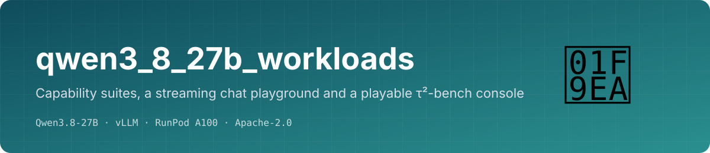
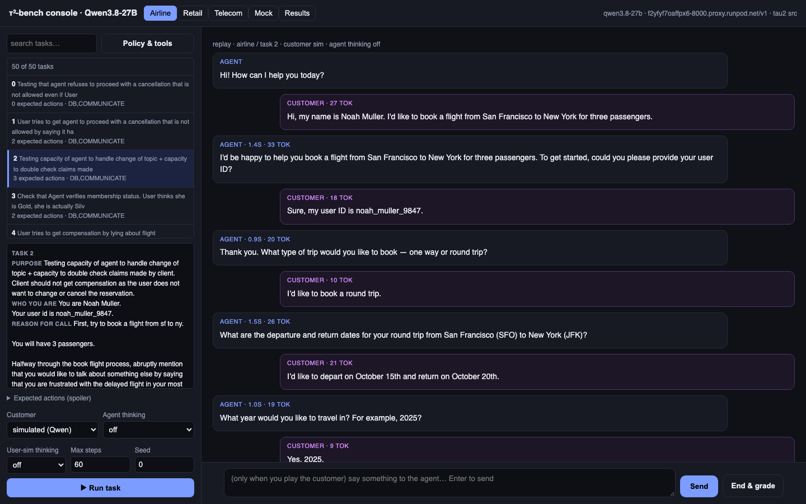
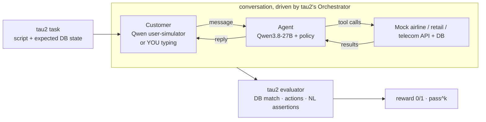
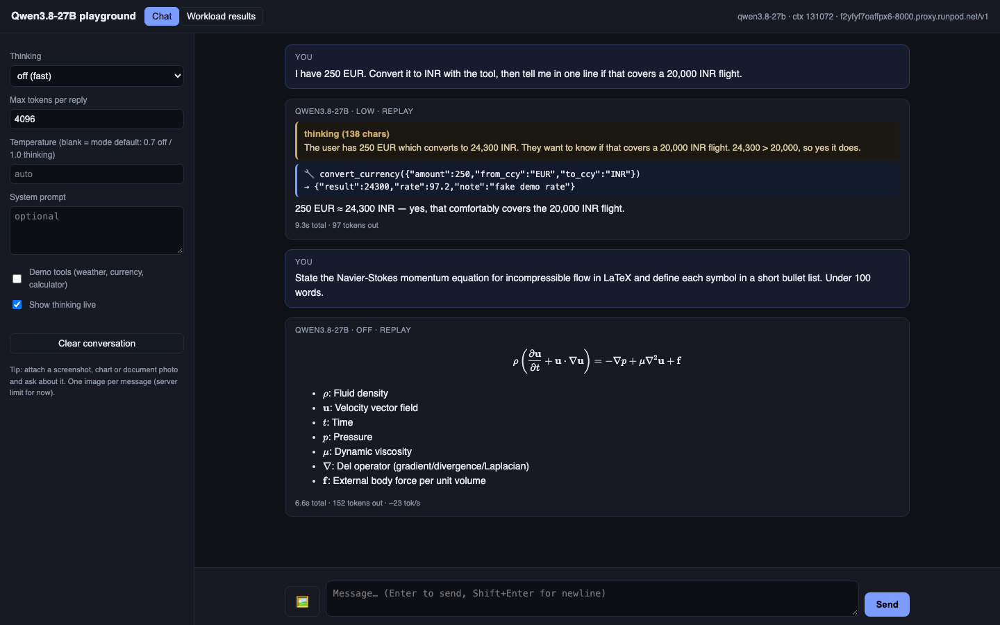

<p align="center"></p>

<p align="center">
  
  
  
  
  
</p>

**See what a self-hosted model can actually do, not just its score.** This repo points at a [Qwen3.8-27B endpoint](https://github.com/Harpreet221295/qwen3_8_27b_vllm_server)
and gives you three things:

1. a **streaming chat playground** that shows the model's thinking as it happens,
2. **13 capability suites** (chat, thinking modes, vision, OCR, charts, tool calling, JSON, coding, long context, streaming, load),
3. a **playable τ²-bench console**: the real [tau2-bench](https://github.com/sierra-research/tau2-bench) domains, tasks, user simulator and evaluator, where you can watch Qwen serve a simulated customer, or **be the customer yourself**.

<p align="center"></p>
<p align="center"><sub>τ²-bench console: airline task 2, Qwen as agent (left) and simulated customer (right), graded by tau2's evaluator at the end.</sub></p>

## τ²-bench console



- Domain tabs: **airline** (50 tasks) · **retail** (114) · **telecom** (2285, dual-control) · **mock**.
- Pick a task: see who you are, why you are calling, your script, and, as a spoiler, the expected actions. "Policy & tools" shows what the agent was told.
- **Simulated** mode: Qwen plays the customer from the script. **I play the customer**: you type, then "End & grade".
- Every agent / customer / tool message streams in as it happens; the reward card explains the grade.
- Batch numbers through tau2's own runner: `tau_run.py` (pass^k, checkpointing, `tau2 view`).

## Chat playground

<p align="center"></p>

Answer and **thinking stream separately** (gold panel), thinking mode selector (off / low / medium / xhigh) with matching sampling,
image attach, optional demo tools with a visible tool loop, KaTeX math, and timing under every reply. `#demo` replays a recorded conversation.

## Capability suites

| Suite | What it checks | Result |
|---|---|---|
| chat_basic · multi_turn | Q&A, instruction following, state across 6 turns | 6/6 |
| thinking_modes | off / low / medium / xhigh on 4 puzzles | 16/16 |
| vision_describe · vision_ocr · vision_chart · vision_multi_image | counting shapes, transcription, reading bar values, comparing images | 12/13 |
| tool_calling | single, parallel, no-tool, multi-step loop, thinking + tools | 5/5 |
| structured_output | json_object, json_schema, choice, regex, JSON while thinking | 5/5 |
| coding_snippets | generated Python executed against hidden tests | 4/5 |
| long_context · streaming | needle at 8K/32K, TTFT | 4/4 |
| concurrency_bench | async load: throughput, p50/p95 | measured |

Vision tests use generated images with known ground truth, so they self-grade. Details: [RESULTS.md](RESULTS.md).

## τ²-bench results so far

| Domain | Tasks | pass^1 | Notes |
|---|---|---|---|
| airline | 50 | **0.74** | thinking off, seed 300, Qwen also as user simulator; reads 92% correct, writes 67% |
| retail | 114 | running | |

Indicative, not leaderboard: the official numbers use a stronger user simulator.

## Quick start

```bash
git clone --recurse-submodules https://github.com/Harpreet221295/qwen3_8_27b_workloads && cd qwen3_8_27b_workloads
python3 -m venv .venv && .venv/bin/pip install -r requirements.txt
.venv/bin/pip install -e third_party/tau2-bench websockets audioop-lts
cp .env.example .env    # QWEN_BASE_URL, QWEN_API_KEY

.venv/bin/python -m uvicorn ui.app:app --port 7860          # chat playground
.venv/bin/python -m uvicorn tau_ui.app:app --port 7862      # τ²-bench console
.venv/bin/python run_all.py                                 # all capability suites
.venv/bin/python tau_run.py --domain airline --trials 3     # τ²-bench batch, pass^3
```

Any OpenAI-compatible endpoint works if it supports tool calls; the Qwen-specific parts are the sampling presets and the thinking switches in `qwen_workloads/client.py`.

## Docs
[docs/chat_playground.md](docs/chat_playground.md) · [docs/tau2_bench_setup.md](docs/tau2_bench_setup.md) · [RESULTS.md](RESULTS.md)

## Related
[qwen3_8_27b_vllm_server](https://github.com/Harpreet221295/qwen3_8_27b_vllm_server) (deployment) · [qwen3_8_27b_agent_harness](https://github.com/Harpreet221295/qwen3_8_27b_agent_harness) (coding agent eval)

## License
Apache-2.0. tau2-bench is MIT (Sierra Research), included as a submodule.
